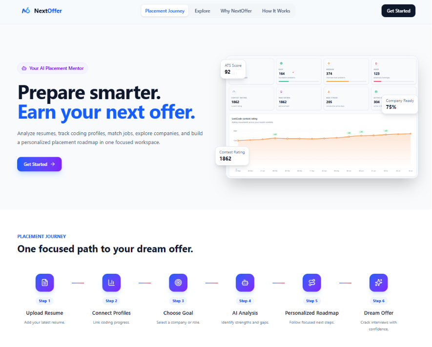
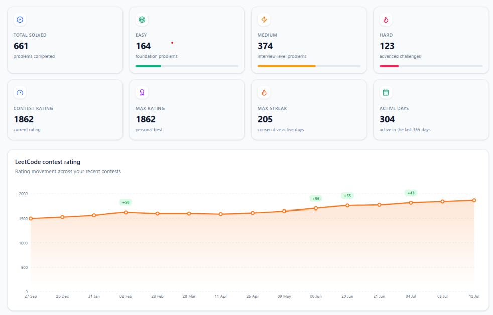
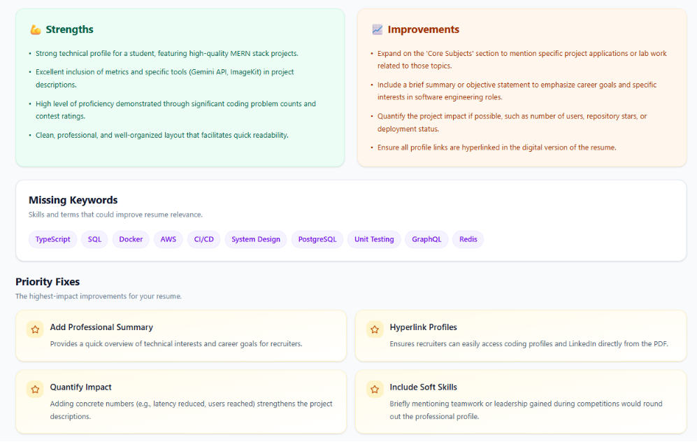
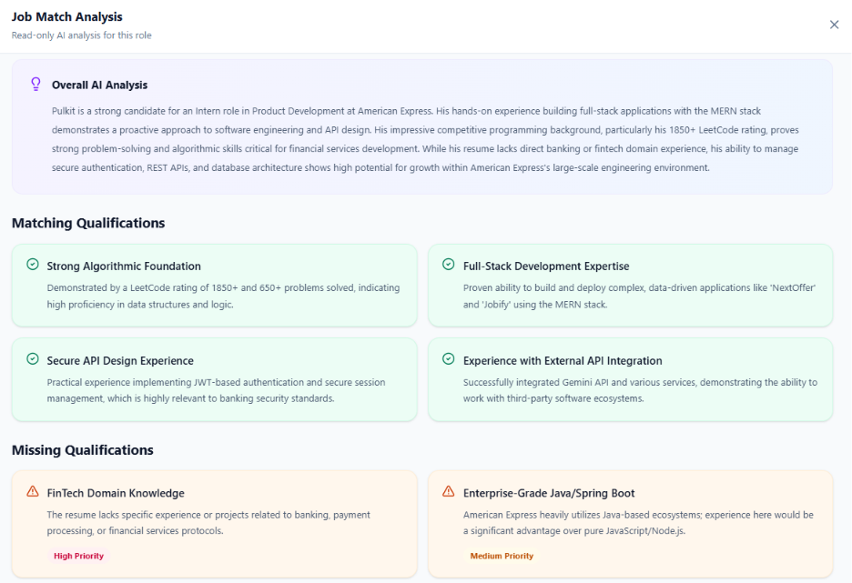
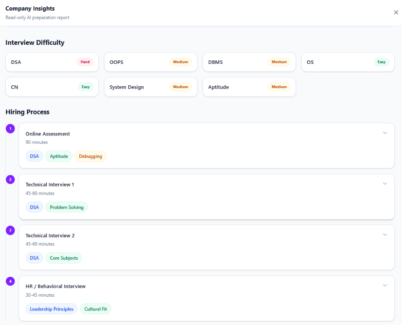
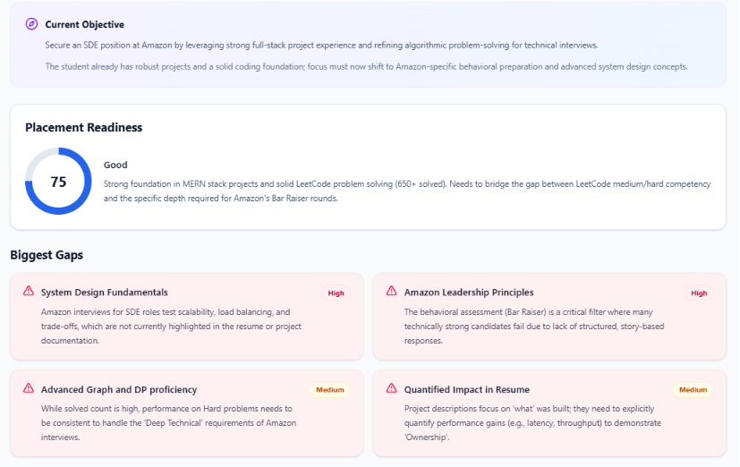
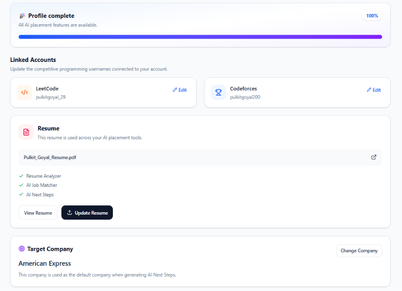

# 🚀 NextOffer

<div align="center">

### AI-Powered Placement Preparation Platform for Software Engineering Students

Track your coding progress, analyze resumes with AI, match jobs, research companies, and receive personalized placement roadmaps—all in one platform.

[](https://next-offer-gamma.vercel.app)
[](https://nextoffer-ywyo.onrender.com)

</div>

---

# 📌 Overview

Preparing for placements usually requires switching between multiple websites:

- Resume analyzers
- LeetCode
- Codeforces
- Company interview experiences
- Job descriptions
- AI tools

**NextOffer** combines all of these into one AI-powered platform that helps software engineering students prepare smarter for placements.

---

# ✨ Features

## 🔐 Authentication

- Secure JWT Authentication
- Protected Routes
- Persistent Login
- Profile Management

---

## 📄 AI Resume Analyzer

- Upload Resume (PDF)
- AI Resume Analysis using Google Gemini
- ATS Score
- Placement Readiness Score
- Resume Structure Review
- Missing Keywords Detection
- Improvement Suggestions
- Resume History

---

## 💻 Coding Profile Analytics

### LeetCode

- Total Problems Solved
- Difficulty Breakdown
- Contest Rating
- Topic Analysis
- Contest History

### Codeforces

- Rating
- Maximum Rating
- Contest History
- Submission Statistics

---

## 🎯 AI Job Matcher

Compare your resume against any job description and receive:

- Match Percentage
- Matching Qualifications
- Missing Skills
- Strengths
- Weaknesses
- AI Suggestions

---

## 🏢 AI Company Insights

Generate detailed company-specific placement information:

- Hiring Process
- Difficulty Analysis
- Important DSA Topics
- Frequently Asked LeetCode Questions
- Core Subjects
- Resume Tips
- Work Culture
- Key Qualities

---

## 🧠 AI Next Steps

Generate a personalized placement roadmap including:

- Current Objective
- Placement Readiness
- Biggest Skill Gaps
- DSA Roadmap
- Contest Strategy
- Company Focus
- Weekly Action Plan
- Monthly Milestones
- Interview Preparation Plan

---

# 📸 Screenshots

## Home



---
## Dashboard



---

## Resume Analyzer



---

## Job Matcher



---

## Company Insights



---

## AI Next Steps



---

## Profile



---

# 🛠 Tech Stack

## Frontend

- React
- Vite
- Tailwind CSS
- Redux Toolkit
- React Router
- Axios
- Recharts

## Backend

- Node.js
- Express.js
- MongoDB
- Mongoose
- JWT Authentication
- Multer
- ImageKit

## AI

- Google Gemini API

---

# 🏗 Architecture

```
Frontend (React + Redux)
            │
            ▼
      Express Backend
            │
 ┌──────────┼──────────┐
 │          │          │
 ▼          ▼          ▼
MongoDB   Gemini    External APIs
           API     (LeetCode / Codeforces)
```

---

# 📂 Project Structure

```
NextOffer/
│
├── client/
│   ├── public/
│   │
│   ├── src/
│   │   ├── api/
│   │   ├── app/
│   │   ├── assets/
│   │   ├── components/
│   │   ├── constants/
│   │   ├── layouts/
│   │   ├── pages/
│   │   ├── routes/
│   │   ├── utils/
│   │   ├── App.jsx
│   │   ├── index.css
│   │   └── main.jsx
│   │
│   ├── ...
│
├── server/
│   ├── assets/
│   ├── src/
│   │   ├── config/
│   │   ├── controllers/
│   │   ├── middlewares/
│   │   ├── models/
│   │   ├── prompts/
│   │   ├── routes/
│   │   ├── services/
│   │   ├── utils/
│   │   ├── app.js
│   │   └── server.js
│   │
│   ├── ...
│
├── assets/
│
├── .gitignore
└── README.md
```

---

# ⚙️ Installation

## Clone Repository

```bash
git clone https://github.com/goyalpulkit719-arch/NextOffer.git
```

---

## Frontend

```bash
cd client
npm install
npm run dev
```

---

## Backend

```bash
cd server
npm install
npm run dev
```

---

# 🔑 Environment Variables

## Frontend

```env
VITE_API_URL=
```

---

## Backend

```env
PORT=
MONGODB_URI=
JWT_SECRET=
GEMINI_API_KEY=
GEMINI_MODEL=
IMAGEKIT_PRIVATE_KEY=
CLIENT_URL=
```

---

# 🚀 Live Deployment

## Frontend

https://next-offer-gamma.vercel.app

## Backend API

https://nextoffer-ywyo.onrender.com

---

# 💡 Challenges Solved

- JWT Authentication using HTTP-only Cookies
- Cross-Origin Authentication (Vercel + Render)
- AI Prompt Engineering
- Resume Parsing with Google Gemini
- API Caching
- Coding Profile Integration
- Responsive Dashboard Design

---

# 🔮 Future Improvements

- AI Mock Interviews
- HR Interview Preparation
- System Design Module
- Interview Experience Sharing
- Email Notifications
- Interview Tracker

---

# 👨‍💻 Author

### Pulkit Goyal

GitHub

https://github.com/goyalpulkit719-arch

LinkedIn

https://linkedin.com/in/pulkit-goyal1

---

## ⭐ If you found this project useful, consider giving it a star!